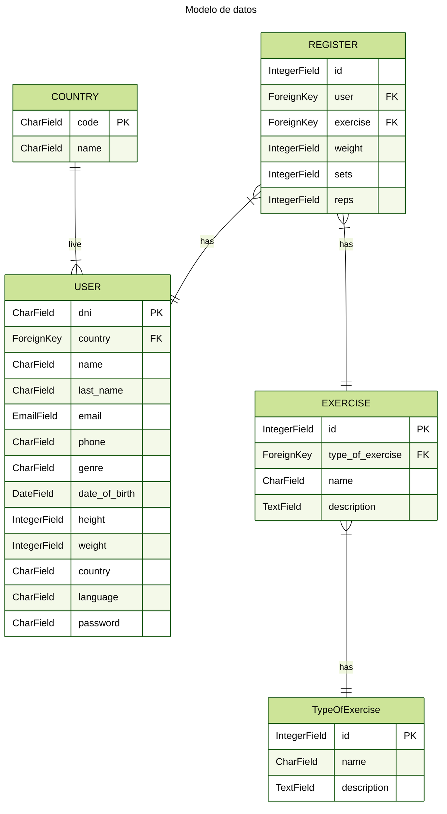

# Página web de seguimiento de ejercicios de Crossfit

## Objetivos

* Consolidar los conocimientos sobre programación y el lenguaje Python y adentrarse en el desarrollo de aplicaciones web usando el framework Django.
* Hacer una aplicación web y consolidar esos conocimientos.
* Fuera de los objetivos:
* Divertirse
* Aprender

## Descripción del proyecto

* Aplicación web de seguimiento de ejercicios de crossfit realizados por una persona, se podrá registrar los avances que la persona realiza en un determinado ejercicio que se escoja. Se podrá consultar un histórico de los avances que se realizan a lo largo del tiempo.
* Se podrá registrar el peso con el que se realizan los ejercicios, el número de repeticiones, el número de rondas y el tiempo durante el que se realizó el ejercicio.

## Modelo de datos

* El modelo de datos se presenta a continuación

